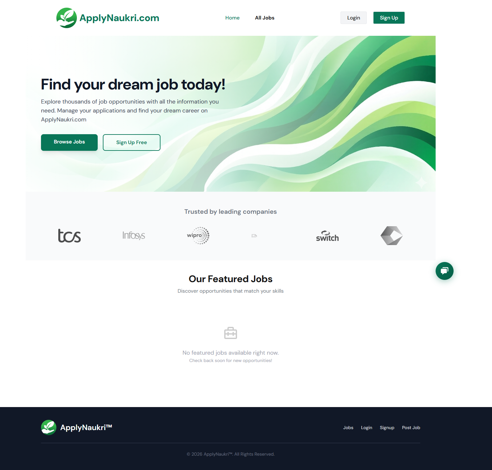
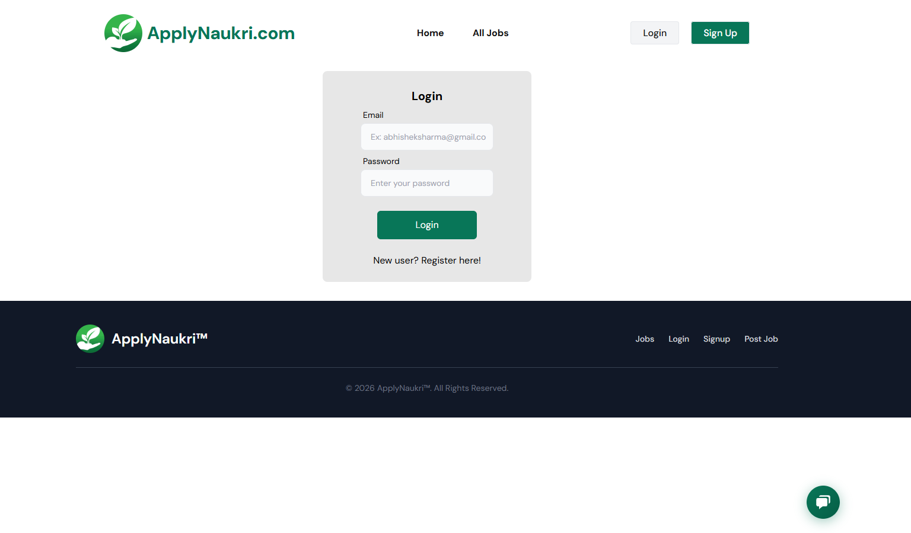
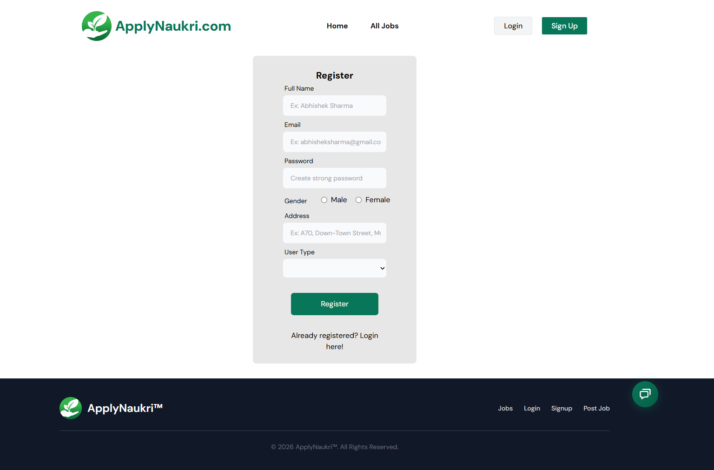
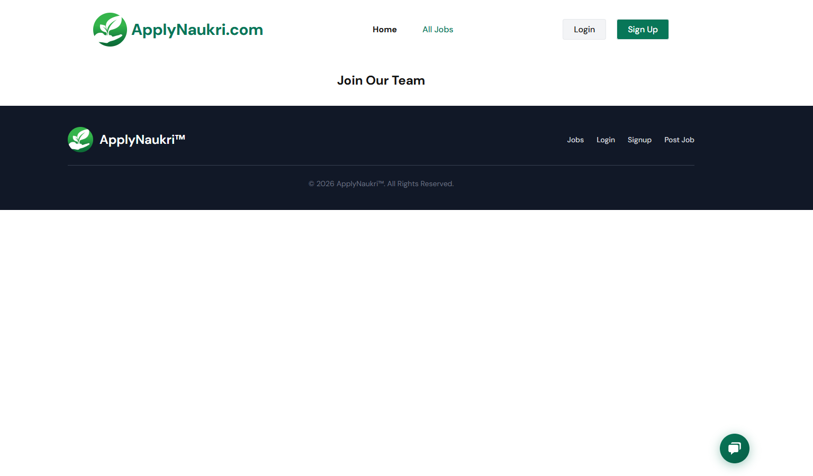
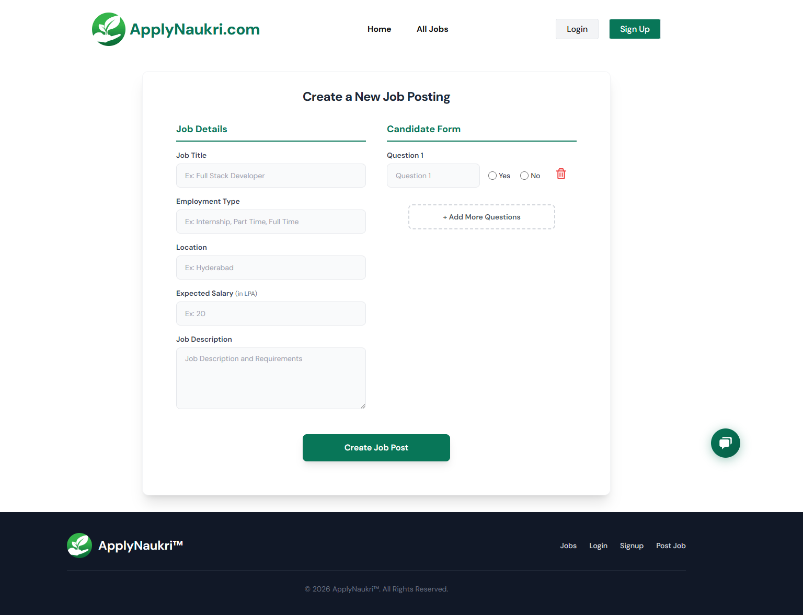
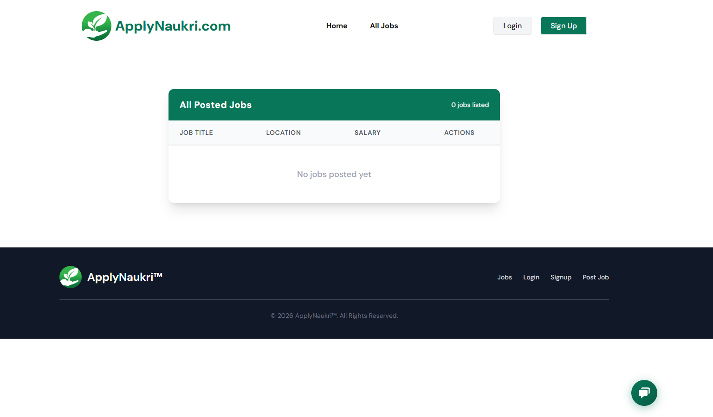
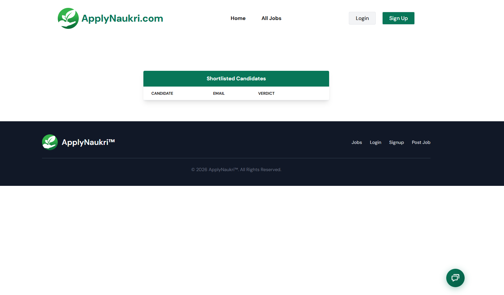
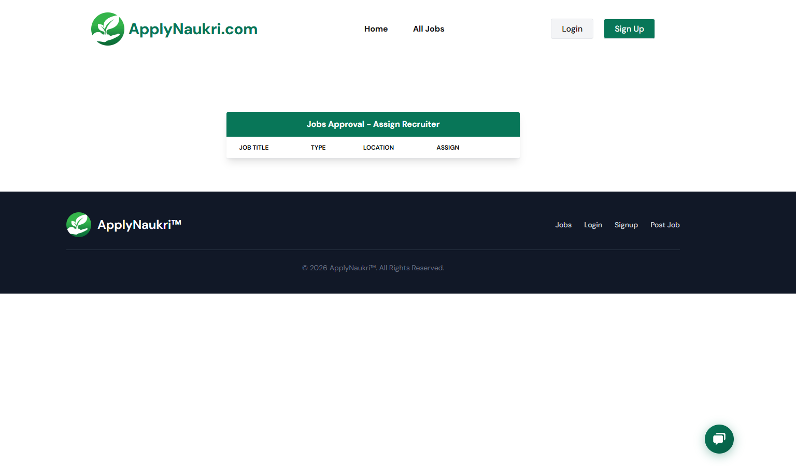
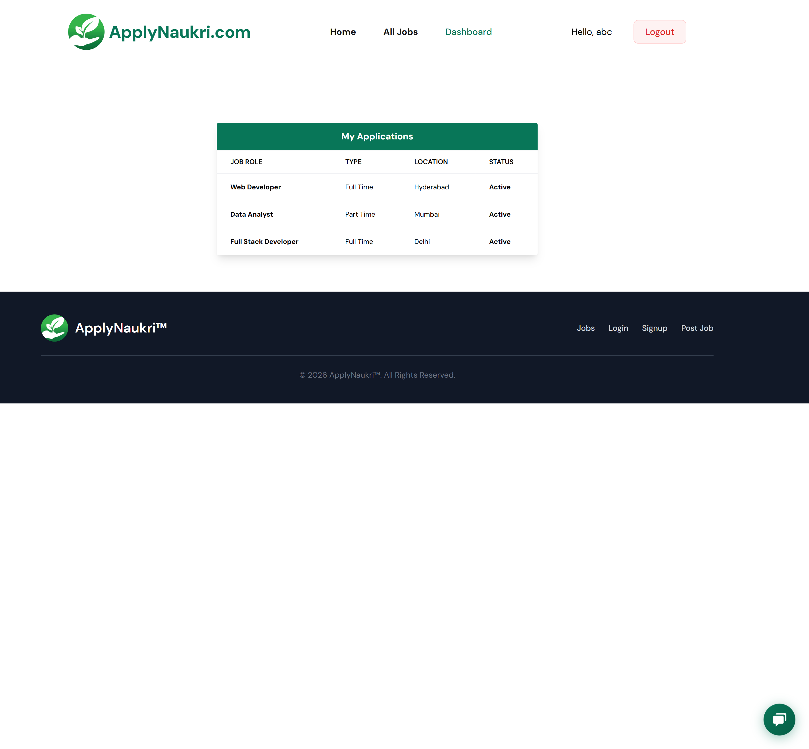

# ApplyNaukri.com — Application Tracking System

A fully functional Applicant Tracking System (ATS) built with the MERN stack (MongoDB, Express, React, Node.js). It manages job postings, receives applications, and creates a structured hiring workflow with role-based dashboards for Employers, Coordinators, Recruiters, and Candidates.

---

## Features

- **Role-based authentication** — Separate flows for Candidate, Employer, Coordinator, and Recruiter
- **Job posting & management** — Employers create job posts with descriptions and screening forms
- **Application submission & tracking** — Candidates browse jobs, apply, and track status
- **Coordinator workflow** — Approve job posts, assign recruiters, add R2 check forms
- **Recruiter screening** — Review applications, complete R2 forms, shortlist candidates
- **Shortlisted candidates view** — Visible on both Employer and Coordinator dashboards
- **AI Chatbot assistant** — Built-in chatbot for platform help and FAQs
- **Responsive design** — Mobile-friendly UI with TailwindCSS
- **Modern UI** — Clean hero section, trusted partners strip, featured jobs grid

---

## Screenshots

### Homepage


### Login


### Sign Up


### All Job Listings


### Employer — Post a Job


### Employer — Dashboard


### Shortlisted Candidates


### Coordinator — Dashboard


### Candidate — Dashboard


---

## Tech Stack

| Layer | Technologies |
|-------|-------------|
| **Frontend** | React 18, React Router, TailwindCSS, React Hook Form, React Toastify, Boxicons |
| **Backend** | Node.js, Express, Mongoose, JWT, Multer (file uploads) |
| **Database** | MongoDB |
| **Auth** | Firebase, JSON Web Tokens, bcryptjs |

---

## Installation

**1. Clone the repository:**
```bash
git clone https://github.com/twriAdarsh/application-tracking-system.git
cd application-tracking-system
```

**2. Install server dependencies:**
```bash
cd server
npm install
```

**3. Install client dependencies:**
```bash
cd client
npm install
```

**4. Create a `.env` file in the `server/` directory:**
```env
MONGODB_URL=your_mongodb_connection_string
JWT_SECRET=your_jwt_secret
```

**5. Start the server:**
```bash
cd server
node index.js
```

**6. Start the client:**
```bash
cd client
npm start
```

**7. Open your browser:**
Navigate to [http://localhost:3000](http://localhost:3000)

---

## Usage

1. Create user accounts for each role: **Candidate**, **Employer**, **Coordinator**, **Recruiter**
2. **Employer** — Create job postings with descriptions and R1 screening forms
3. **Coordinator** — Approve posts, assign recruiters, add R2 screening forms, publish jobs
4. **Candidate** — Browse all job listings, view details, apply with resume and R1 form
5. **Recruiter** — Review applications, complete R2 form, shortlist candidates
6. Shortlisted candidates appear on both Employer and Coordinator dashboards
7. Use the **chatbot** (bottom-right corner) for quick help on any page

---

## Project Structure

```
├── client/                 # React frontend
│   ├── public/             # Static assets & JSON data
│   └── src/
│       ├── assets/img/     # Images & banners
│       ├── components/     # Shared components (Navbar, Footer, ChatBot, etc.)
│       │   ├── Home/       # Hero, FeaturedJobs, OurCompanies, JobDetails
│       │   ├── Login/      # Login & Register forms
│       │   └── ContextProvider/
│       ├── Pages/          # Role-based page components
│       │   ├── Candidate/  # ApplicationForm, MyJobs
│       │   ├── Coordinator/# CoordinatorDashboard, AssignRecruiter
│       │   ├── Employer/   # Home, PostJob, AllJobs, UpdateJob
│       │   └── Recruiter/  # RecruiterDashboard, CandidateProfile
│       └── Router/         # App routing
├── server/                 # Express backend
│   ├── config/             # DB connection
│   ├── controllers/        # Route handlers (Auth, Job, Application, User, Recruiter)
│   ├── middleware/          # JWT verification
│   ├── models/             # Mongoose schemas (User, Job, Application, Recruiter)
│   └── routes/             # API route definitions
└── Screenshots/            # Application screenshots
```

---

## SRS Summary

### Problem Statement
Design an Applicant Tracking System (ATS) that manages job postings, receives applications, and creates a hiring workflow.

### User Roles
| Role | Responsibilities |
|------|-----------------|
| **Candidate** | Browse jobs, apply with resume, track application status |
| **Employer** | Create job posts with descriptions and R1 screening forms |
| **Coordinator** | Approve posts, assign recruiters, add R2 forms, publish jobs |
| **Recruiter** | Screen applications, complete R2 forms, shortlist candidates |

### Job Posting Flow
1. Employer creates a job post (description + R1 check form)
2. Coordinator approves the post, assigns recruiters, adds R2 check form
3. Coordinator publishes the job — it goes live for candidates

### Application Flow
1. Candidate creates an account, browses job listings, applies (resume + R1 form)
2. Recruiter reviews applications, completes R2 form, shortlists candidates
3. Shortlisted applications appear on Employer and Coordinator dashboards

---

## Author

- [@twriAdarsh](https://github.com/twriAdarsh)

